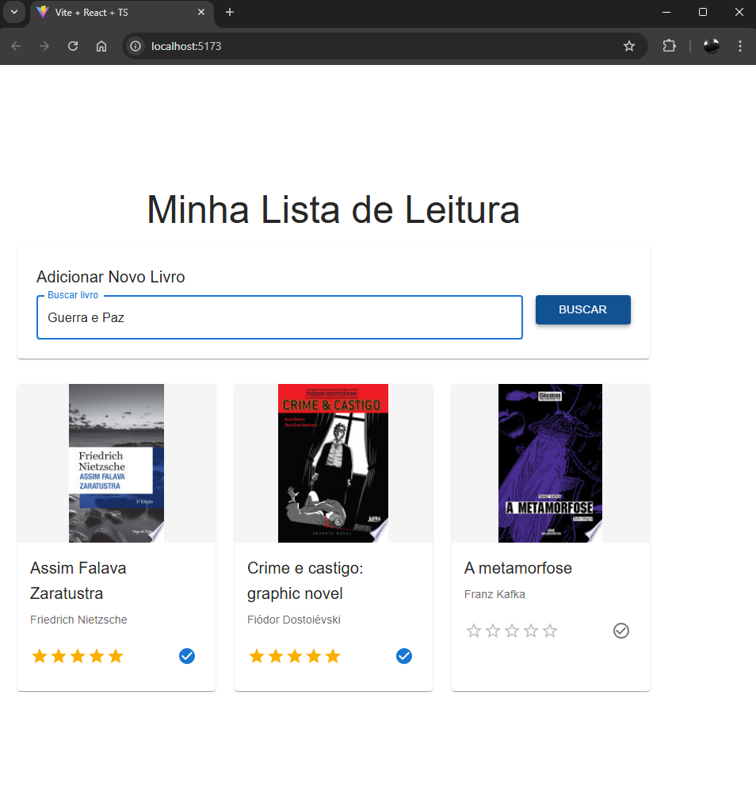

# Lista de Leitura

Uma aplicação web moderna para gerenciar sua lista de leitura, desenvolvida com React, TypeScript e Material-UI.

## Funcionalidades

- 🔍 Busca de livros através da API do Google Books
- 📚 Adição de livros à sua lista de leitura
- ✅ Marcação de livros como lidos/não lidos
- ⭐ Sistema de avaliação por estrelas
- 🎨 Interface moderna e responsiva
- 📱 Design adaptável para diferentes tamanhos de tela

## Tecnologias Utilizadas

- React 19
- TypeScript
- Material-UI (MUI)
- Axios
- Vite

## Integração com Google Books API

A aplicação utiliza a API do Google Books para buscar informações sobre os livros. A integração é feita através do endpoint:

```
https://www.googleapis.com/books/v1/volumes
```

### Funcionalidades da API

- Busca automática de livros por título
- Preenchimento automático de informações como:
  - Título
  - Autores
  - Descrição
  - Imagem da capa
  - ID único do livro

## Como Usar

1. Digite o título do livro que deseja adicionar na barra de busca
2. Pressione Enter ou clique no botão "Buscar"
3. O livro será automaticamente adicionado à sua lista
4. Use o botão de check para marcar o livro como lido/não lido
5. Use as estrelas para avaliar o livro

## Estrutura do Projeto

```
src/
  ├── components/
  │   ├── AddBookForm.tsx    # Formulário de busca e adição de livros
  │   └── BookList.tsx       # Lista de livros e controles
  ├── types/
  │   └── Book.ts           # Interface TypeScript para livros
  └── App.tsx               # Componente principal
```

## Interface do Livro

Cada livro na aplicação possui as seguintes propriedades:

```typescript
interface Book {
  id: string;          // ID único do livro
  title: string;       // Título do livro
  authors: string[];   // Lista de autores
  description: string; // Descrição do livro
  thumbnail: string;   // URL da imagem da capa
  isRead: boolean;     // Status de leitura
  rating: number;      // Avaliação (0-5)
  addedAt: Date;       // Data de adição
}
```

## Instalação e Execução

1. Clone o repositório
2. Instale as dependências:
   ```bash
   npm install
   ```
3. Execute o projeto em modo de desenvolvimento:
   ```bash
   npm run dev
   ```
4. Acesse a aplicação em `http://localhost:5174`

## Build para Produção

Para criar uma versão otimizada para produção:

```bash
npm run build
```



